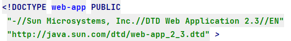
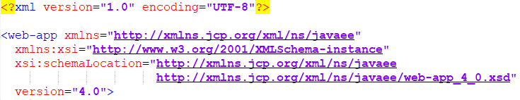

# 配置Maven

## 安装Maven

>### 下载maven并解压到本地指定位置
>
>* 下载地址：https://dlcdn.apache.org/maven/
>
>* 解压并配置`apache-maven-x.x.x\conf\conf\settings.xml文件`
>
>  1. 配置本地仓库地址：
>
>     ```xml
>     <!-- 本地仓库的路径 -->
>     <localRepository>D:\Maven_LocalRepository\localrepository</localRepository>
>     ```
>
>  2. 配置阿里云镜像源：
>
>     * `<mirrorOf>*</mirrorOf>`
>       * `mirrorOf`可以理解为一个拦截器，它的值表达了一个/多个仓库ID
>         * 如果为`*`号是匹配所有的仓库ID
>         * 如果是具体的值，就对应具体的ID
>       * 如果匹配到了之后，被匹配的repository的url会被替换成mirror中的url
>     * `<mirrorOf>指定的远程仓库名</mirrorOf>`
>
>     ```xml
>     <!-- 配置阿里云镜像 -->
>     <mirrors>
>     	<mirror>
>     	    <id>aliyunmaven</id>
>     	    <mirrorOf>*</mirrorOf>
>     	    <name>阿里云公共仓库</name>
>     	    <url>https://maven.aliyun.com/repository/public</url>
>     	</mirror>
>     	 
>     	<mirror>
>     	    <id>alimaven1</id>
>     	    <mirrorOf>central</mirrorOf>
>     	    <name>aliyun maven</name>
>     		<url>https://maven.aliyun.com/repository/public</url>
>     	</mirror>
>     	
>     	<mirror>  
>     	    <id>alimaven2</id> 
>     	    <mirrorOf>central</mirrorOf>
>     	    <name>aliyun maven</name>
>     	    <url>http://maven.aliyun.com/repository/public</url>
>     	</mirror>
>     	 
>     	<mirror>
>     	    <id>nexus-aliyun</id>
>     	    <mirrorOf>*</mirrorOf>
>     	    <name>Nexus aliyun</name>
>     	    <url>http://maven.aliyun.com/nexus/content/groups/public</url>
>     	</mirror>
>     	
>     	<mirror>
>     	    <id>jboss-public-repository-group</id>
>     	    <mirrorOf>central</mirrorOf>
>     	    <name>JBoss Public Repository Group</name>
>     	    <url>http://repository.jboss.org/nexus/content/groups/public</url>
>     	</mirror>
>     </mirrors>
>     ```
>
>* 配置maven的`系统环境变量`。
>
>  1. 新建系统环境变量`maven_home`
>
>     ```properties
>     MAVEN_HOME=D:\Maven_LocalRepository\apache-maven-3.8.4
>     ```
>
>  2. 将新建的系统环境变量引入`Path`
>
>     ```properties
>     %MAVEN_HOME%\bin
>     ```
>
>### 然后在cmd下测试查看`maven`的安装版本，以及对应的当前`jdk`的版本
>
>1. 查看当前`maven`的版本：`mvn -v`
>
>   
>
>2. 其它`maven`命令:
>
>   | 命令                | 描述                                                         |
>   | ------------------- | ------------------------------------------------------------ |
>   | `maven clear`       | 对项目进行清理，删除target目录下编译的内容                   |
>   | `maven compile`     | 编译项目源代码                                               |
>   | `maven test`        | 对项目进行运行测试                                           |
>   | `mvn package`       | 打包文件并存放到项目的target目录下，打包好的文件通常都是编译后的class文件 |
>   | `mvn install`       | 在本地仓库生成仓库的安装包，供其他项目引用，同时打包后的文件放到项目的target目录下 |
>   | `mvn      validate` | 用于验证项目是否真确，并且其说有必要信息是否都可用           |
>   | `mvn verify`        | 这步是用来验证test，并检查test的结果是否满足标准             |
>   | `mvn site`          | 生成站点文件                                                 |
>   | `mvn deloy`         | 部署项目到云服务器                                           |
>
>### maven中pom文件标签
>
>1. `<project>` : 根元素，包含约束信息
>2. `<modelVersion>` : 指定当前pom的版本
>
>3. `<groupId>` : 反写的公司网址+项目名
>
>4. `<artifactId>` : 项目名+模块名
>
>5. `<version>` : 版本号。
>   * 一般为三位数，大版本号.分支版本号.小版本号。
>   * 版本类型一般有5种：snapshot（快照）、alpha（内部测试）、beta（公测）、release（稳定版本）、GA（正式发布）
>
>6. `<packaging>` : 打包方式，一般为`jar`、`war`、`zip`、`pom`
>
>7. `<name>` : 项目描述名
>
>8. `<url>` : 项目地址
>
>9. `<description>` : 项目描述
>10. `<dependencyManagement>` : 依赖管理，包含一个依赖列表
>11. `<dependencies>` : 依赖列表，包含依赖项
>12. `<dependency>` : 依赖项
>    * 其中包含groupId，artifactId，version，type，scope（依赖范围），optional（设置依赖是否可选，默认false），exclusions（排除依赖传递列表）
>
>13. `<build>` :
>
>14. `<plugins>` : 插件列表
>
>15. `<plugin>` :
>
>19. `<modules>` : 实现maven的聚合
>
>20. `<module>` : 实现maven的聚合
>21. `<parent>` : 对父模块的pom的集成
>22. `<exclusions>`:依赖排除标签
>
>### maven依赖范围`<scope>`标签
>
>scope标签指定的依赖范围，有3种作用域，分别是`编译`、`测试`和`运行时期`。
>`scope标签`的值，有6种类型，分别是：
>
>- `compile`：默认值，编译测试和运行都有效
>- `provided`：编译和测试的时候有效，运行时候不生效
>- `runtime`：测试和运行时候有效
>- `test`：只在测试的时候有效
>- `system`：在编译和测试的时候有效，与本机系统关联，可移植性较差
>- `import`：导入的范围，使用在dependencyManagement标签中，表示从其他的pom中导入dependency的配置
>
>### IDEA中配置安装好的本地`maven`仓库
>
>
>
>### IDEA中配置每次创建新项目的`maven`设置
>
>
>
>
>
>### 创建基于`maven`骨架的`JavaSE`测试项目
>
>1. 选择指定类型的项目
>
>   
>
>2. 指定项目信息（项目名，全限定性包名(一般为公司域名或项目网站名)，项目版本）
>
>   
>
>3. 确认信息并创建
>
>   
>
>4. 安装好之后配合IDEA中的插件：`maven search插件`来使用。
>
>5. 一定要注意自己的网速是否畅通。
>
>***若果当前`maven`要更换另一个版本的`JDK`，安装好`JDK`后直接更换系统环境变量中`JAVA_HOME`的值为指定`JDK`的路径。`PATH`环境变量依然保持`%JAVA_HOME%\bin`***

# 配置Tomcat

>* 若电脑安装了多个`Tomcat`安装时需修改`windows`服务名，要不然会引起冲突。
>
>  
>
>* 然后配置tomcat的环境变量，只有一个tomcat时不用配置（以防止冲突）。
>
>  ```properties
>  #先新建系统环境变量
>  CATALINA_HOME=D:\ApacheTomcat\Tomcat 9.0_IDEA_Tomcat9
>  ```
>
>  ```properties
>  #再引入到系统环境变量PATH中
>  %CATALINA_HOME%\bin
>  ```
>
>* 然后CMD下去测试，分别输入
>
>  * 开启服务器：`startup.bat`
>  * 关闭服务器：`shutdown.bat`
>  * *若cmd中中文乱码则是由于tomcat与cmd编码不一致引起的，建议不要修改，我们只要保证IDE中不乱码就行。*
>  * 若IDE中tomcat控制台中文乱码，首先确保IDE中的所有编码格式为`UTF-8`以及新项目的编码，若是在IDEA中还需要在`help`下拉菜单中选择编辑`VM`参数，新加一条：`-Dfile.encoding=UTF-8`

# 利用`Maven`创建父子模块`web`项目并测试`maven`与`Tomcat`

>1. 新建一个`maven`项目作为内部模块的整体，记住不要勾选`create from archetype`相当于一个空项目，但项目创建好之后还需要删除项目自带 的`src`包，并通过`<packaging>`标签指定当前空项目的打包方式。
>
>   ```xml
>   <!-- 根模块的打包方式 -->
>   <packaging>pom</packaging>
>   ```
>
>2. 然后在空项目处右击选择`new Modules`创建子模块，此时就和创建正常web项目一样勾选`create from archetype`选择对应骨架`apache:maven-archetype-webapp骨架`进行项目创建。
>
>3. 创建好子模块后赋值子模块下`pom.xml`文件中的`<parent>...</parent>`中的内容然后执行`maven`的刷新功能，然后又回到子模块的`pom.xml`文件下将`<parent>...</parent>`内容粘回去。
>
>4. 确保根模块中有：
>
>   ```xml
>   <!-- 根模块中包含的子模块 -->
>   <modules>
>           <module>web1</module>
>   </modules>
>   ```
>
>5. 确保子模块有：
>
>   ```xml
>   <!-- 当前子模块中对应的根模块 -->
>   <parent>
>       <groupId>com.mofany</groupId>
>       <artifactId>webmodules</artifactId>
>       <version>1.0-SNAPSHOT</version>
>   </parent>
>   ```
>
>6. 最后在根模块下通过`<dependencyManagement>`标签管理所有子模块要用的`jar`包的版本
>
>   ```xml
>    <!-- 根模块下约束子模块jar包的版本 -->
>   <dependencyManagement>
>   	<dependencies>
>   		<dependency>
>               <!-- jar包完整路径=groupId+artifactId -->
>   			<groupId>jar包的路径</groupId>
>   			<artifactId>模块名</artifactId>
>   			<version>jar包版本</version>
>   			<!-- 指定测试有效还是其它场景有效 -->
>   			<scope>test</scope>
>   		</dependency>
>   	</dependencies>
>   </dependencyManagement>
>   ```
>
>7. 最后测试子模块运行是否正常。
>

## `maven`骨架创建的web项目的web.xml文件版本号与tomcat下的web.xml文件版本号不一致

>- maven骨架生成的`web.xml`开头
>  - 路径：`本地仓库\org\apache\maven\archetypes\maven-archetype-webapp\1.4\maven-archetype-webapp-1.4.jar`
>
>
>
>- tomcat原生的web.xml文件的开头
>
>  
>
>- 利用压缩软件打开maven本地仓库的的webapp的jar包，覆盖其内容后保存
>
>  ```xml
>  <?xml version="1.0" encoding="UTF-8"?>
>  
>  <web-app xmlns="http://xmlns.jcp.org/xml/ns/javaee"
>    xmlns:xsi="http://www.w3.org/2001/XMLSchema-instance"
>    xsi:schemaLocation="http://xmlns.jcp.org/xml/ns/javaee
>                        http://xmlns.jcp.org/xml/ns/javaee/web-app_4_0.xsd"
>    version="4.0">
>    
>  
>    
>    </web-app>
>  ```